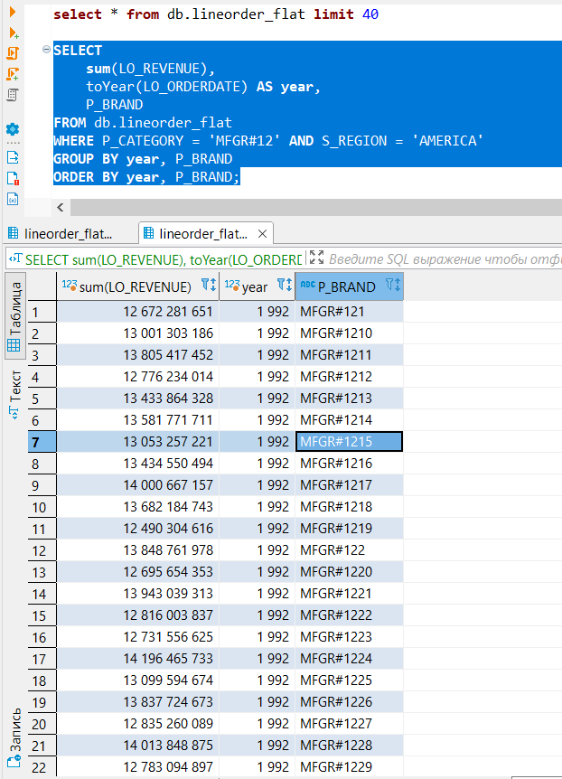
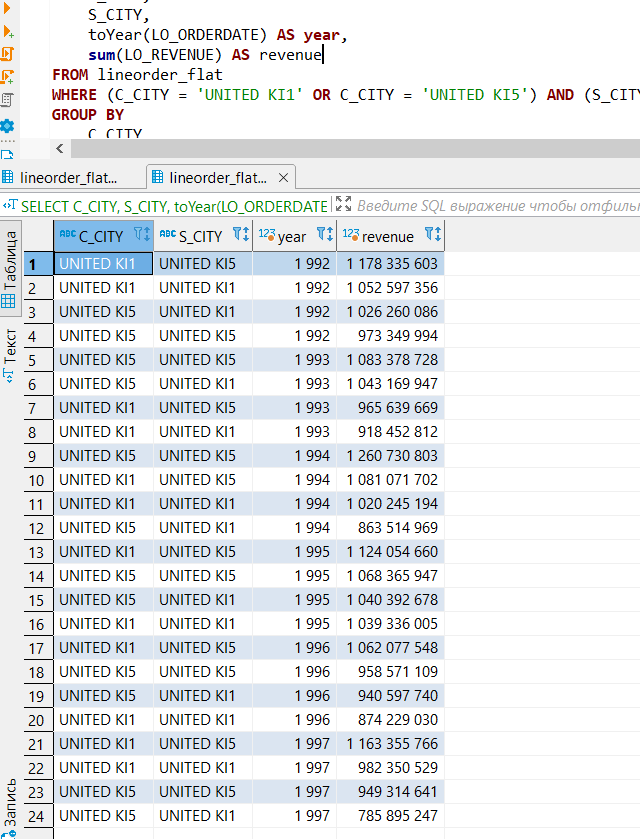
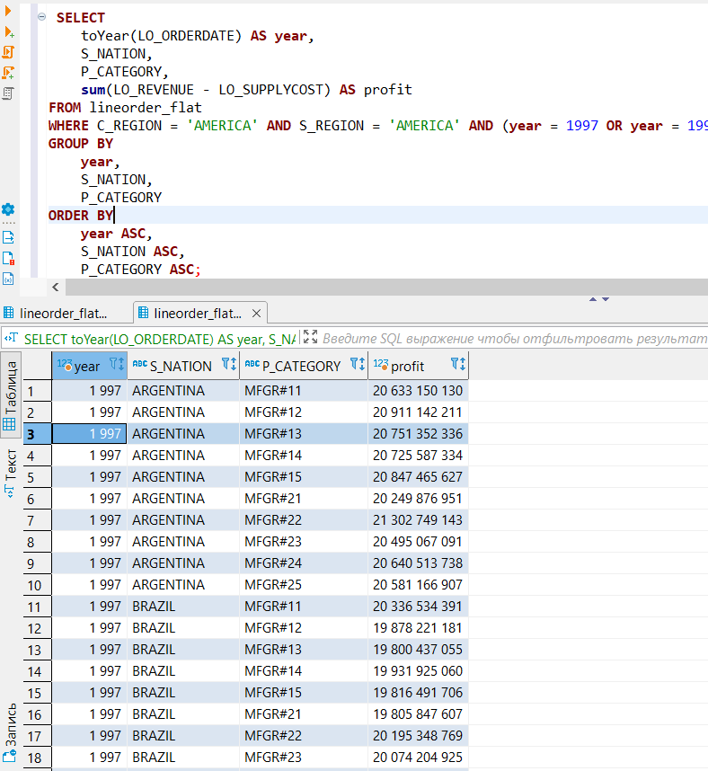

### Конфигурирование и запуск проекта dbt

[Задание](https://gist.github.com/kzzzr/8d50126079df1a8e5646342f6247df22)

### Шаги выполнения:

1. Настройка ClickHouse c помощью CLI
```
yc managed-clickhouse cluster create clickhouse02task --description "Clickhouse for homework" --environment production --version 21.11 --clickhouse-resource-preset b2.medium --clickhouse-disk-type network-ssd --clickhouse-disk-size 30G --database name=db --user name=clickhouse,password=clickhouse --network-name default --host type=clickhouse,zone-id=ru-central1-a,assign-public-ip=true
```
2. Настройка окружения
```
python3.9 -m pipenv install dbt==0.20.0 dbt-clickhouse==0.20.0
python3.9 -m pipenv shell
```
3. Инициализация проекта dbt
```
dbt init clickhouse_starschema
```
4. Подключение к базе данных в кластере ClickHouse.
Получение SSL-сертификата: https://cloud.yandex.ru/docs/managed-clickhouse/operations/connect
```
mkdir -Force $HOME\.clickhouse; `
(Invoke-WebRequest https://storage.yandexcloud.net/cloud-certs/CA.pem).RawContent.Split([Environment]::NewLine)[-31..-1] `
  | Out-File -Encoding ASCII $HOME\.clickhouse\YandexInternalRootCA.crt; `
Import-Certificate `
  -FilePath  $HOME\.clickhouse\YandexInternalRootCA.crt `
  -CertStoreLocation cert:\CurrentUser\Root
```
profiles.yml
```
clickhouse_starschema:
  target: dev
  outputs:
    dev:
      type: clickhouse
      schema: db
      host: <host>
      port: 9440
      user: <user>
      password: <password>
      secure: True
```
5. Решение проблемы с выполнением тестов unique, not_null.
Команда ```dbt test``` выдает ошибку ```0.0 is not of type 'boolean'```. Решение данной проблемы описано по [ссылке](https://github.com/dbt-labs/dbt-core/issues/3872).
Необходимо создать следующий макрос:
```

    select
      {{ fail_calc }} as failures,
      case when {{ fail_calc }} {{ warn_if }}
        then 'true' else 'false' end as should_warn,
      case when {{ fail_calc }} {{ error_if }}
        then 'true' else 'false' end as should_error
    from (
      {{ main_sql }}
      {{ "limit " ~ limit if limit != none }}
    ) dbt_internal_test

```
6. Запрос Q2.1


7. Запрос Q3.3


8. Запрос Q4.2
